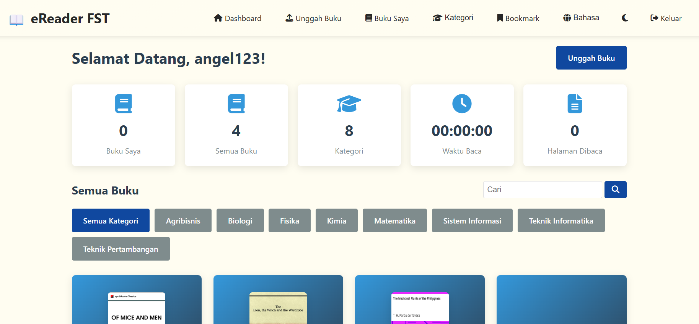

# 📚 Web-Based ePub Reader

Aplikasi perpustakaan digital interaktif berbasis web untuk mengelola dan membaca file buku digital berformat `.epub`. Proyek ini mengintegrasikan sistem manajemen database untuk menyimpan koleksi buku pengguna secara personal.

### 🔗 Live Demo
👉 **https://epub-reader.ct.ws/dashboard.php**

---

<p align="center">
  
  
  
</p>

---

### 🛠️ Tech Stack
* **Backend:** PHP 8.x (Prosedural & CRUD logic)
* **Database:** MySQL/MariaDB (Relational Database)
* **Frontend:** HTML5, CSS3, JavaScript
* **Reader Engine:** [ePub.js](https://github.com/futurepress/epub.js/)
* **Styling:** Font Awesome icons & Responsive CSS

---

### ✨ Fitur Utama
* **User Authentication:** Sistem login dan registrasi untuk keamanan data pengguna.
* **Book Management (CRUD):** * **Upload:** Unggah file `.epub` dengan validasi otomatis.
  * **Personal Dashboard:** Melihat daftar koleksi buku yang sudah diunggah lengkap dengan progres bacaan.
  * **Delete:** Menghapus buku dari koleksi perpustakaan pribadi.
* **Interactive E-Reader:** * Navigasi antar halaman (Next/Previous).
  * Panel Daftar Isi (Table of Contents) yang interaktif.
  * Sinkronisasi progres bacaan secara real-time.

---

### 🗄️ Struktur Database
Proyek ini menggunakan database `epub_reader` dengan tabel utama:
* **`users`**: Menyimpan kredensial akun pengguna.
* **`books`**: Menyimpan informasi file ePub, cover, dan relasi ke user id.
* **`reading_progress`**: Mencatat posisi terakhir pengguna saat membaca.

---

### ⚙️ Cara Instalasi (Local Development)

1. **Persiapan:**
   Pastikan Anda sudah menginstal **XAMPP** atau server lokal lainnya.
2. **Clone Repository:**
   ```bash
   git clone [https://github.com/RevanyAngel/epub-reader-FST.git](https://github.com/RevanyAngel/epub-reader-FST.git)
3. **Setup Database:**
* **Buka phpMyAdmin.
* **Buat database baru dengan nama epub_reader.
* **Import file epub_reader.sql ke database tersebut.
4. **Konfigurasi Koneksi:**  
  Sesuaikan host, user, dan password database pada file db.php (atau file koneksi terkait).
5. **Jalankan:**
  Pindahkan folder proyek ke C:/xampp/htdocs/ dan akses via browser di localhost/epub-reader-FST.
